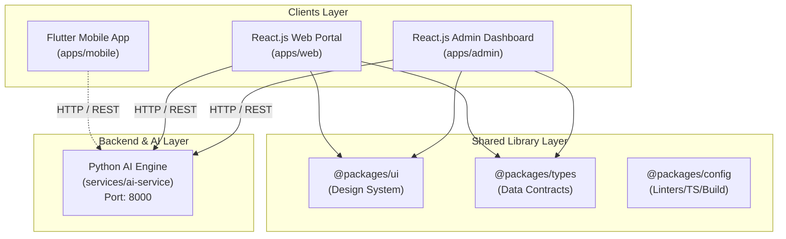

# Monorepo System Architecture

---

## 1. Client Applications (`apps/`)
- **`apps/mobile`**: Built using Flutter for iOS, Android, and Web deployment. Employs Feature-First / Clean Architecture.
- **`apps/web`**: Customer/user-facing React application bundled with Vite for fast HMR and build performance.
- **`apps/admin`**: Administrative control panel for user management, system statistics, and AI token/cost monitoring.

## 2. Services (`services/`)
- **`services/ai-service`**: FastAPI backend handling AI completions, RAG context retrieval, embedding computations, and custom ML inferences.

## 3. Shared Packages (`packages/`)
- **`@packages/types`**: Type declarations and API schema contracts to ensure end-to-end type safety between clients and services.
- **`@packages/ui`**: Atomic UI component library (Buttons, Cards, inputs) shared by `apps/web` and `apps/admin`.
- **`@packages/config`**: Reusable ESLint, Prettier, and TypeScript configurations.

## 4. Orchestration
- **pnpm + Turborepo**: Manages workspace linking and dependency task pipelines (`build`, `test`, `lint`, `dev`) across all JS/TS packages.
